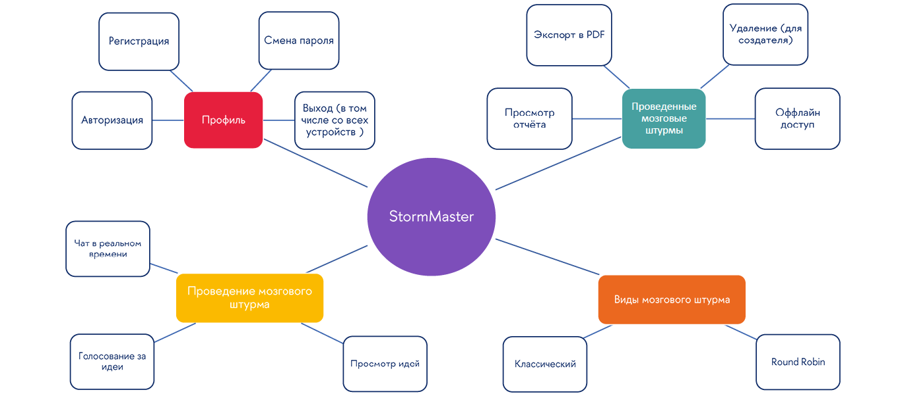
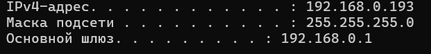
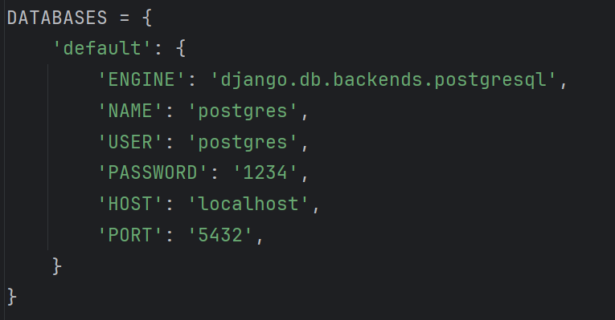

# StormMaster. Клиент-серверное приложение для проведения мозговых штурмов
### Статус сервера: не активен

<br>

# Описание приложения

Данное приложение предназначено для организации и проведения сессий мозгового штурма с использованием различных методик (реализованы методики классического мозгового штурма и методика Round Robin). Приложение позволяет пользователям обмениваться сообщениями в реальном времени для формирования идей, которые в последствии сохраняются для оффлайн доступа на устройстве пользователя и могут быть экспортированны в PDF. Данные о проведенных мозговых штурмах также дополнительно сохраняются на сервере, поэтому пользователь может работать с приложением с разных устройств и синхронизировать их работу с помощью интернета.

## Использованный стек технологий

<div align="center"><b>Сервер</b></div>

<div align="center">
	
	
	
</div>

* Django
* Django REST Framework
* Django Channels
* DRF-YASG
* PostgreSQL

<div align="center"><b>Клиент (приложение)</b></div>

<div align="center">
	
	
</div>

* Android Studio
* Java
* XML разметка
* Room
* Retrofit
* OkHttp
* ITextPdf

## Демонстрация работы

<br>

## Все функции приложения


## Презентация проекта
[Ссылка на презентацию](https://disk.yandex.ru/i/XDexwUVRtJIGig)


# Как запустить приложение в локальной сети?

1. **Узнайте локальный ip адрес компьютера** <br>
    Для Windows:
    ``` cmd
    ipconfig
    ```
    

2. **Склонируйте проект или загрузите zip**
   ``` cmd
   git clone https://github.com/ziopam/StormMasterApp.git
   ```
3. **Перейдите в папку server и установите все необходимые библиотеки Python**
   ```cmd
   pip install -r requirements.txt
   ```
4. **Перейдите в папку `server/StormMasterServer/` и откройте файл `settings.py`**  
    В нем укажите данные для входа в базу данных PostgreSQL в словарь `DATABASES`(необходимые таблицы будут созданы автоматически при запуске сервера). Пример:
    
    
    Если нет желания/возможности создания PostgreSQL базы данных, то можно переключиться на SQLite базу данных. Для этого замените словарь выше на этот (NAME можно поменять при желании):
    ```python
    DATABASES = {
        'default': {
            'ENGINE': 'django.db.backends.sqlite3',
            'NAME': BASE_DIR / 'db.sqlite3',
        }
    }
    ```

    Это создаст файл SQLite базы данных `db.sqlite3` рядом с файлом manage.py.

5. **Создайте необходимые таблицы в базе данных**
   ```cmd
   python manage.py migrate
   ```
6. **Откройте уже скаченный репозиторий StormMasterApp в Android Studio**
7. **Перейдите в `StormMasterApp\app\src\main\java\com\example\stormmasterclient\helpers\API\APIConfig.java`**  
    Установите в переменную `BASE_URL` полученный в шаге 1 локальный адрес и укажите через : желаемый порт (например, 8000).
    ```Java
    public static final String BASE_URL = "http://192.168.0.193:8000/";
    ```
8. **Соберите приложение и установите его на свое устройство**
9. **Запустите сервер с помощью команды**
    ```cmd
    python manage.py runserver <ваш_ip_адрес:порт>
    ```
10. **Готово!**

**(Опционально) Активируйте отображение документации API запросов к серверу**  
Вы можете включить отображение Swagger документации, которая будет доступна по ссылке `<ваш_ip_адрес:порт>/doc/`.
Для этого перейдите к файлу `server/StormMasterServer/settings.py` и установите значение переменной DEBUG true.
```python
DEBUG = True
```